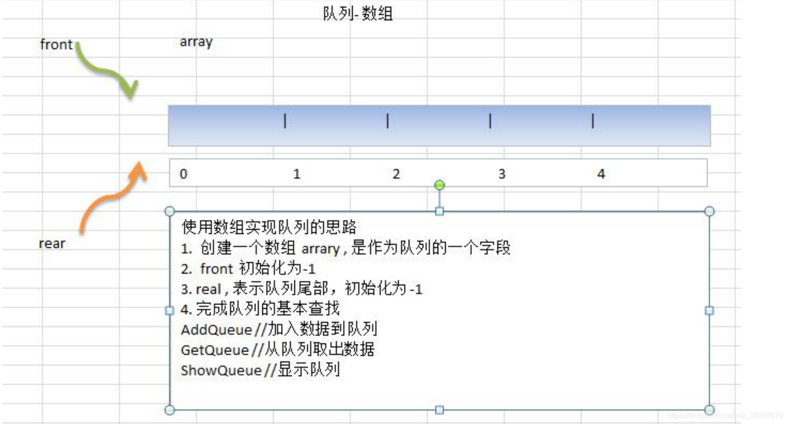

#### 数组模拟队列思路

+ 脑海中浮现一个结构体，有两个指针：front、rear分别为-1，有一个容量数：maxSize，一个容量数组arr
+ 添加时将尾指针往后移动即rear+1，获取时front+1
+ 当rear=maxSize-1时对列满，当rear == front时对列空



#### 应用实例

```
package main
import (
	"fmt"
	"os"
	"errors"
)
//使用一个结构体管理队列
type Queue struct {
	maxSize int
	array [5]int // 数组=>模拟队列
	front int // 表示指向队列首
	rear int // 表示指向队列的尾部
}
//添加数据到队列
func (this *Queue) AddQueue(val int) (err error) {
	//先判断队列是否已满
	if this.rear == this.maxSize - 1 { //重要重要的提示; rear 是队列尾部(含最后元素)
		return errors.New("queue full")
	}
	this.rear++ //rear 后移
	this.array[this.rear] = val
	return
}
//从队列中取出数据
func (this *Queue) GetQueue() (val int, err error) {
	//先判断队列是否为空
	if this.rear == this.front { //队空
		return -1, errors.New("queue empty")
	}
	this.front++
	val = this.array[this.front]
	return val ,err
}
//显示队列, 找到队首，然后到遍历到队尾
//
func (this *Queue) ShowQueue() {
	fmt.Println("队列当前的情况是:")
	//this.front 不包含队首的元素
	for i := this.front + 1; i <= this.rear; i++ {
		fmt.Printf("array[%d]=%d\t", i, this.array[i])
	}
	fmt.Println()
}
//编写一个主函数测试，测试
func main() {
	//先创建一个队列
	queue := &Queue{maxSize : 5, front : -1, rear : -1, }
	var key string
	var val int
	for {
		fmt.Println("1. 输入 add 表示添加数据到队列")
		fmt.Println("2. 输入 get 表示从队列获取数据")
		fmt.Println("3. 输入 show 表示显示队列")
		fmt.Println("4. 输入 exit 表示显示队列")
		fmt.Scanln(&key)
		switch key {
		case "add":
			fmt.Println("输入你要入队列数")
			fmt.Scanln(&val)
			err := queue.AddQueue(val)
			if err != nil {
				fmt.Println(err.Error())
			} else {
				fmt.Println("加入队列 ok")
			}
		case "get":
			val, err := queue.GetQueue()
			if err != nil {
				fmt.Println(err.Error())
			} else {
				fmt.Println("从队列中取出了一个数=", val)
			}
		case "show":
			queue.ShowQueue()
		case "exit":
			os.Exit(0)
		}
	}
}
```

