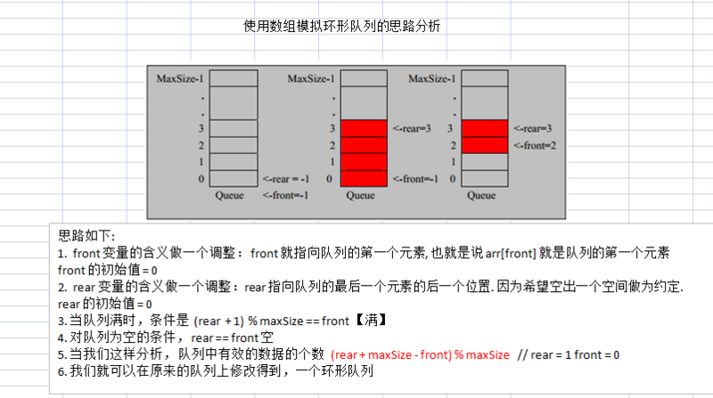

#### 数组模拟环形队列思路

+ 脑海中浮现一个结构体，有两个指针：front、rear分别为0，有一个数组容量数：maxSize，一个容量数组arr
+ rear=(rear+1)%maxSize；当(rear + 1) % maxSize == front队列填满
+ front = (front + 1) % maxSize；当rear == front队列取空
+ 对列里的个数 (rear + maxSize - front ) % maxSize



#### 应用实例

```
package main
import (
	"fmt"
	"errors"
	"os"
)
 
//使用一个结构体管理环形队列
type CircleQueue struct {
	maxSize int
	array [4]int // 数组
	head int //指向队列队首 0
	tail int //指向队尾 0
}
 
//入队列
func (this *CircleQueue) Push(val int) (err error) {
	if this.IsFull() {
		return errors.New("queue full")
	}
	//分析出 this.tail 在队列尾部，但是包含最后的元素
	this.array[this.tail] = val //把值给尾部 0
	this.tail = (this.tail + 1) % this.maxSize
	return
}
 
//出队列
func (this *CircleQueue) Pop() (val int, err error) {
	if this.IsEmpty() {
		return 0, errors.New("queue empty")
	}
	//取出,head 是指向队首，并且含队首元素
	val = this.array[this.head]
	this.head = (this.head + 1) % this.maxSize
	return
}
 
//显示队列
func (this *CircleQueue) ListQueue() {
	fmt.Println("环形队列情况如下：")
	//取出当前队列有多少个元素
	size := this.Size()
	if size == 0 {
		fmt.Println("队列为空")
	}
	//设计一个辅助的变量，指向 head
	tempHead := this.head
	for i := 0; i < size; i++ {
		fmt.Printf("arr[%d]=%d\t", tempHead, this.array[tempHead])
		tempHead = (tempHead + 1) % this.maxSize
	}
	fmt.Println()
}
 
//判断环形队列为满
func (this *CircleQueue) IsFull() bool {
	return (this.tail + 1) % this.maxSize == this.head
}
 
//判断环形队列是空
func (this *CircleQueue) IsEmpty() bool {
	return this.tail == this.head
}
 
//取出环形队列有多少个元素
func (this *CircleQueue) Size() int {
	return (this.tail + this.maxSize - this.head ) % this.maxSize
}
 
func main() {
 
	//初始化一个环形队列
	queue := &CircleQueue{maxSize : 4, head : 0, tail : 0, }
	var key string
	var val int
	for {
		fmt.Println("1. 输入 add 表示添加数据到队列")
		fmt.Println("2. 输入 get 表示从队列获取数据")
		fmt.Println("3. 输入 show 表示显示队列")
		fmt.Println("4. 输入 exit 表示显示队列")
		fmt.Scanln(&key)
		switch key {
		case "add":
			fmt.Println("输入你要入队列数")
			fmt.Scanln(&val)
			err := queue.Push(val)
			if err != nil {
				fmt.Println(err.Error())
			} else {
				fmt.Println("加入队列 ok")
			}
		case "get":
			val, err := queue.Pop()
			if err != nil {
				fmt.Println(err.Error())
			} else {
				fmt.Println("从队列中取出了一个数=", val)
			}
		case "show":
			queue.ListQueue()
		case "exit":
			os.Exit(0)
		}
	}
}
```

