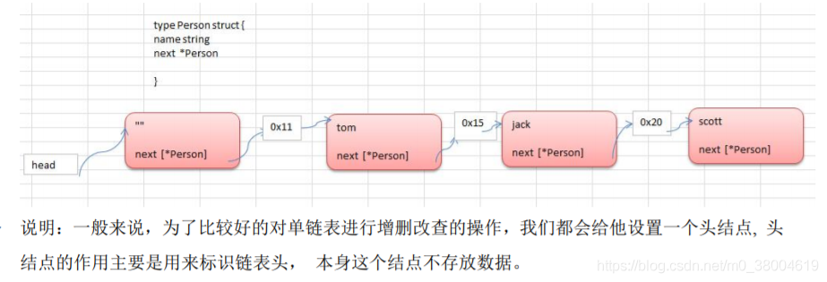

#### 单向链表数据结构



- 它在内存中是存储如下，不要求内存连续，靠next指针关联起来
- 链表的物理存储方式为随机存储，访问方式为顺序访问

#### 单向链表的缺点

- 单向链表查找的方向只能是一个方向。
- 单向链表不能自我删除，需要靠辅助节点 。

#### 单向链表添加思路

+ 脑海中浮现一个结构体包括：一个元素名；一个next节点
+ 实例化一个头结点用来串联
+ 每次添加节点时从头节点开始遍历直到找到尾节点，将next节点一次指向下一个节点形成链表

```
//定义一个 HeroNode
type HeroNode struct {
	no int
	next *HeroNode //这个表示指向下一个结点
}

//给链表插入一个结点 根据 no 的编号从小到大插入..【实用】
func InsertHeroNode(head *HeroNode, newHeroNode *HeroNode) {
	temp := head
	for {
		if temp.next == nil {
			temp.next = newHeroNode
			break
		}
		//开始比对下一个节点
		temp = temp.next
	}
}
```

#### 单向链表删除思路

+ 脑海中浮现出一个串好的单链表
+ 从头节点开始遍历判断当前节点的下一个节点是否是被删除节点，如果是被删除节点，则将当前节点的下一个节点指向被删除的节点的下一个节点

```
//删除节点
func DeleteHeroNode(head *HeroNode, id int) {
	temp := head
	for  {
		if temp.next.no == id {
			temp.next = temp.next.next
			break
		}
		//开始比对下一个节点
		temp = temp.next
	}
}
```

#### 单向链表修改思路

+ 脑海中浮现出一个串好的单链表
+ 从头节点开始遍历判断当前节点的下一个节点是否是被修改节点，如果是被修改节点，则将新改节点的下一个节点指向被修改节点
+ 当前节点的下一个节点指向新节点

```
//修改节点
func UpdateHeroNode(head *HeroNode, newHeroNode *HeroNode) {
	temp := head
	for {
		if temp.next.no == newHeroNode.no {
			newHeroNode.next =temp.next.next
			temp.next = newHeroNode
			break
		}
		//开始比对下一个节点
		temp = temp.next
	}
}
```