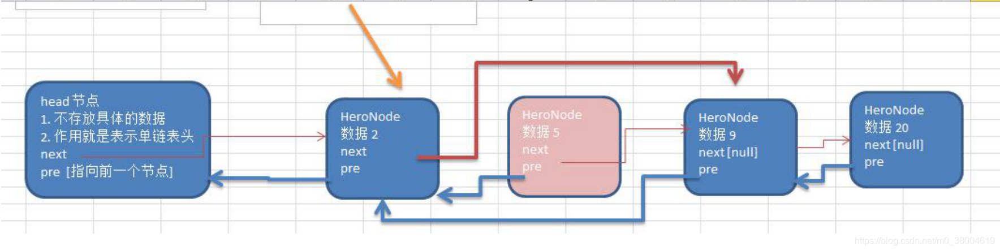

#### 双向链表数据结构

+ 双向链表每一个节点都存有pre和next两个指针
+ 不可以可以实现自我删除、修改需要靠辅助节点



#### 双向链表添加思路

+ 脑海中浮现一个结构体，一个元素名；一个next节点；一个pre节点
+ 实例化一个头结点用来串联
+ 每次添加节点时，从头结点开始遍历直到最后一个节点的next为nil
+ 将最后一个节点的next节点指向新节点
+ 将新节点的pre节点指向最后一个接节点，然后新节点的next指向nil

```
//定义一个 HeroNode
type HeroNode struct {
	no int
	pre *HeroNode //这个表示指向前一个结点
	next *HeroNode //这个表示指向下一个结点
}

func InsertHeroNode(head *HeroNode, newHeroNode *HeroNode) {
	temp := head
	for {
		if temp.next == nil {
			temp.next = newHeroNode
			newHeroNode.pre = temp.next
			break
		}
		temp = temp.next
	}
}
```

#### 双向链表修改思路

+ 脑海中浮现一个串好的双向链表
+ 从头节点开始遍历，当某个节点的下一个节点的编号等于被修改节点时
+ 将当前节点的下一个节点的下一个节点的pre节点指向被修改节点
+ 被修改节点的next节点指向当前节点的下一个节点的下一个节点
+ 当前节点的下一个节点指向被修改节点
+ 被修改节点的上一个节点指向当前节点

```
func UpdateHeroNode(head *HeroNode, newHeroNode *HeroNode) {
	temp := head
	for  {
		if temp.next.no == newHeroNode.no {
			temp.next.next.pre = newHeroNode
			newHeroNode.next = temp.next.next
			temp.next = newHeroNode
			newHeroNode.pre = temp
			break
		}
		temp = temp.next
	}

}
```

#### 双向链表删除思路

+ 脑海中浮现一个串好的双向链表
+ 从头节点开始遍历，当某个节点的下一个节点的编号等于被删除节点时
+ 将当前节点的下一个节点的下一个节点的pre节点指向当前节点
+ 将前节点的下一个节点指向下一个节点的下一个节点

```
func DelHerNode(head *HeroNode, id int) {
	temp := head
	for  {
		if temp.next.no == id{
			temp.next.next.pre = temp
			temp.next = temp.next.next
			break
		}
		temp = temp.next
	}
}
```