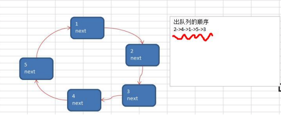

#### 单向环形链表数据结构

+ 环形列表的一个重要特质就是首尾相连，如果只有头节点则next指向自己。



#### 单向环形链表添加思路

+ 脑海中浮现一个结构体，一个元素名；一个next节点
+ 如果只有一个节点，则将该节点赋值给头结点
+ 如果再有新节点则从头节点开始遍历直到当前节点的下一个节点是头结点
+ 则将当前节点的next指向新节点，新节点的next指向头节点

```
type CatNode struct {
	no int //猫猫的编号
	name string
	next *CatNode
}
//添加
func InsertCatNode(head *CatNode, newCatNode *CatNode) {
	if head.next == nil{
		head.no = newCatNode.no
		head.name = newCatNode.name
		head.next = head
	}
	temp := head
	for  {
		if temp.next == head {
			temp.next = newCatNode
			newCatNode.next = head
			break
		}
		temp = temp.next
	}
}
```

#### 单向环形链表修改思路

+ 脑海中浮现一个串好的单向环形列表
+ 从头节点开始遍历，当某个节点的下一个节点的编号等于新节点编号时
+ 将当前节点的下一个节点指向当前节点的下一个节点的下一个节点

```
func UpdateCatNode(head *CatNode, newCatNode *CatNode) {
	temp := head
	for  {
		if temp.next.no == newCatNode.no{
			newCatNode.next = temp.next.next
			temp.next = newCatNode
			break
		}
		temp = temp.next
	}
}
```

#### 单向环形链表删除思路

+ 脑海中浮现一个串好的单向环形列表
+ 如果是头节点，则让下一个节点作为头结点
+ 遍历节点并找到最后一个节点,并将最后一个节点的next节点指向

```
func DelCatNode(head *CatNode, id int) *CatNode {
	//辅助节点
	helper := head
	//如果是头节点，则让下一个节点作为头结点
	if head.no == id {
		head = head.next.next
	}
	temp := head
	for  {
		//找到最后一个节点
		if temp.next == helper {
			temp.next = helper.next //跳过头节点（删除头节点）
			break
		}else if temp.next.no == id {
			temp.next = temp.next.next //删除中间节点
			break
		}
		temp = temp.next
	}
	return head
}
```

