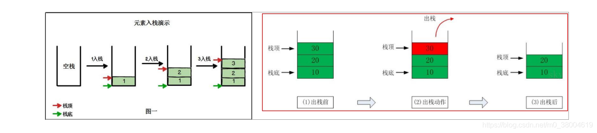

#### 栈的数据结构

- 栈是一个先入后出(FILO-First In Last Out)的有序列表，可以抽象成一个存放子弹的盒子（先入后出来）。
- 根据堆栈的定义可知，最先放入栈中元素在栈底，最后放入的元素在栈顶，而删除元素刚好相反，最后放入的元素最先删除，最先放入的元素最后删除。



#### 入栈实现思路

+ 脑海中浮现一个结构体，包括最大容量MaxTop，栈顶Top，栈arr，Top初始化为-1
+ 从栈顶开始一步一步添加：如果Top == MaxTop-1说明栈满了，因为下标从零开始，否则Top++，arr[this.Top] = val赋值

```
//使用数组来模拟一个栈的使用
type Stack struct {
	MaxTop int    // 表示我们栈最大可以存放数个数
	Top    int    // 表示栈顶, 因为栈顶固定，因此我们直接使用 Top
	arr    [5]int // 数组模拟栈
}

//入栈
func (this *Stack) Push(val int) {
	if this.Top == this.MaxTop-1 {
		fmt.Println("栈满")
		return
	}
	this.Top++
	this.arr[this.Top] = val
	return
}
```

#### 出栈实现思路

+ 脑海中浮现一个子弹夹子，里面装了n颗子弹
+ 从栈顶开始遍历取子弹：如果top ==-1说明子弹取完了，因为下标从零开始，否则否则Top--， val = arr[this.Top] 取值

```
//出栈
func (this *Stack) Pop() {
	if this.Top == -1 {
		fmt.Print("栈里没有数拒了")
		return
	}
	fmt.Println(this.arr[this.Top])
	this.Top--
}
```