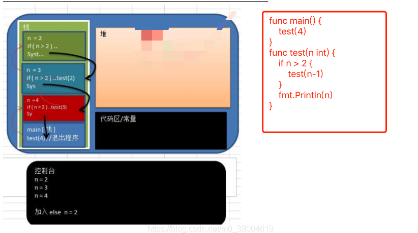

#### 递归调用思路

- 递归就是自己调用自己。
- 当程序执行一个方法就会开辟一个独立的栈空间，每个空间的变量都是独立的。
- 当有条件满足时则会停止递归，进行一层一层的输出每个栈的结果。

#### 递归与回溯的区别

+ 我们在路上走着，前面是一个多岔路口，因为我们并不知道应该走哪条路，所以我们需要尝试。尝试的过程就是一个函数。 
+ 我们选择了一个方向，后来发现又有一个多岔路口，这时候又需要进行一次选择。所以我们需要在上一次尝试结果的基础上，再做一次尝试，即在函数内部再调用一次函数，这就是递归的过程。
+ 这样重复了若干次之后，发现这次选择的这条路走不通，这时候我们知道我们上一个路口选错了，所以我们要回到上一个路口重新选择其他路，这就是回溯的思想。

