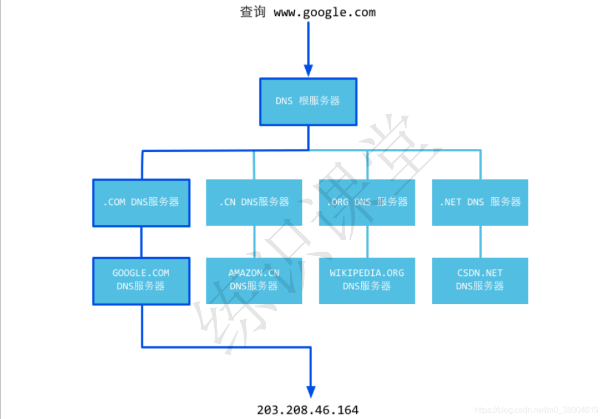

### DNS概念

DNS (Domain Name System)是 “城名系统”的英⽂缩写，它从事将域名转换为实际IP地址的⼯作。DNS就是这样的⼀ 位“翻译官”，它的基本⼯作原理可⽤下图来表示。

### DNS解析过程

- 浏览器中输⼊域名，操作系统会先检查⾃⼰本地的hosts⽂件是否有这个⽹络映射关系，如果有就先调⽤这个IP地址映射，完成域名解析。
- 如果hosts没有域名，会查找TCP/IP参数中设置的⾸选DNS服务器，我们叫它本地DNS服务器，如果有直接返回，完成域名解析。
- 如果上述过程失败，则把请求发给根服务器，根服务器返回⼀个负责该顶级服务器的IP，本地DNS服务器收到IP信息后，再连接该服务器进⾏解析，如果仍然⽆法解析，则发送下⼀级DNS服务器，重复操作直到找到。
- 如果是转发模式则把请求转发⾄上⼀级DNS服务器，假如仍然不能解析，再转发给上上级。不管是否转发，最后都把结果返回给本地DNS服务器上述⼀个是迭代查询，⼀个是递归查询。递归查询的 过程是查询者发⽣了更替，⽽迭代查询过程，查询者不变。

##### 通过上⾯的步骤，我们最后获取的是P地址，也就是浏览器最后发起请求的时候是基于IP来和服务器做信息交互的。

举个例⼦来说，你想知道某个⼀起上法律课的⼥孩的电话，并且你偷偷拍了她的照⽚，回到寝室告诉⼀个很仗义的哥们⼉，这个哥们⼉⼆话没说，拍着胸脯告诉你甭急，我替你查( 此处完成了一 次递归查询，即，问询者的⻆⾊更替) 。然后他拿着照⽚问了学院⼤四学⻓，学⻓告诉他，这姑娘是 xx 系的；然后这哥们⼉⻢不停蹄⼜问了xx 系的办公室主任助理同学，助理同学说是 xx 系 yy 班的，然后很仗义的哥们⼉去xx 系 yy 班的班⻓那⾥取到了该⼥孩⼉电话。 ( 此处完成若千次迭代查询，即，问询者⻆⾊不变，但反复更替问询对象) 最后，他把号码交到了你⼿⾥。完成整个查询过程。

##### 一级域名：

你所认为的一级域名是http://www.ylicms.com还是http://ylicms.com，其实http://ylicms.com这才是一级域名正确的样子，也就是说www只是一个主机名，ylicms是域名主体，.com是域名后缀，注册一级域名的时候是需要付费的。

##### 二级域名：

二级域名是基于一级域名延伸出来的，同时也是免费的。例如：http://web.ylicms.com。二级域名是依附一级域名的存在而存在的，如果一级域名被注销了，不存在了，那么二级域名也不能使用了，但是，如果二级域名网站不做了，主域名是不受影响的。

##### 顶级域名：

我们常接触的顶级域名分为两类：一是国家和地区顶级域名。例如中国是.cn，美国是.us等；二是国际顶级域名，例如表示工商企业的.com，表示非盈利组织的.org，表示网络商的.net等。