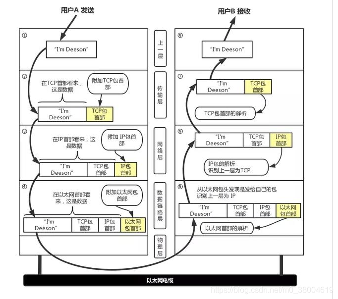

### OSI的七层模型

- 应用层：给用户提供发送数据的接口，如简单电子邮件传输（SMTP）、文件传输协议（FTP）http协议,https等。
- 表示层：将数据转换成二进制(视屏,文本,ppt等等)，加密等。
- 会话层：判断数据是不是需要传输,如果是传给传输层,否则存到硬盘里。
- 传输层：确定协议类型(TCP,UDP)、输入发送端口和目标端口。
- 网络层：确定将发送ip地址和目标ip地址输入进去,IP是负责在互联网(公网)中传递数据。
- 数据链路层：数据是通过一个一个的(局域网)传输的,有mac负责传递数据。
- 物理层：比特流(数据单位)的传输(网线,网卡)传输数据。

### 传输流程

1. 给小红写一份邮件用qq邮箱【应用层】
2. 将数据转换成二进制加密等【表示层】
3. 这封信件是给别人的还是自己留着的【会话层】
4. 写信一般都用TCP协议类型，还得把目标端口号和自己端口号写上【传输层】
5. 这封信的详细地址，收件人和发件人的信息【网络层】
6. 相当于中转站,北京到上海,上海到广州,不是具体地址【数据链路层】
7. 所有处理好的数据发送【物理层】

### 传输原理

+ 每个分层中，都会对所发送的数据附加一个首部，在这个首部中包含了该层必要的信息，如发送的目标地址以及协议相关信息。通常，为协议提供的信息为包首部，所要发送的内容为数据。在下一层的角度看，从上一层收到的包全部都被认为是本层的数据。

