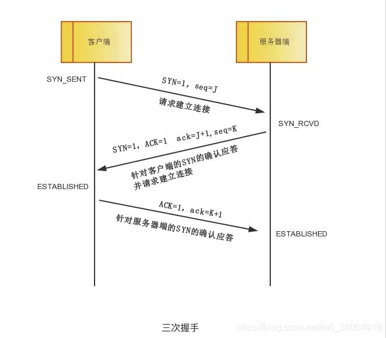

### TCP/IP 的具体含义

+ 对OSI的具体化，将原来的七层合并层四层如下图：

+ 互联网进行通信时，需要相应的网络协议，TCP/IP 原本就是为使用互联网而开发制定的协议族。因此，互联网的协议就是 TCP/IP，TCP/IP 就是互联网的协议

  

### TCP和UDP的区别

1. TCP是面向链接的，虽然说网络的不安全不稳定特性决定了多少次握手都不能保证连接的可靠性，但TCP的三次握手在最低限度上(实际上也很大程度上保证了)保证了连接的可靠性。
2. 而UDP不是面向连接的，UDP传送数据前并不与对方建立连接，对接收到的数据也不发送确认信号，发送端不知道数据是否会正确接收，当然也不用重发，所以说UDP是无连接的、不可靠的一种数据传输协议。
3. 也正由于1所说的特点，使得UDP的开销更小数据传输速率更高，因为不必进行收发数据的确认，所以UDP的实时性更好。

#### TCP的状态

+ SYN表示建立连接
+ FIN表示关闭连接
+ ACK表示响应
+ PSH表示有DATA数据传输
+ RST表示连接重置
+ SEQ表示顺序号码
+ URG表示紧急

### TCP连接的三次握手(为了连接的可靠性)

- 第一次握手：客户端发送syn包(syn=1)到服务器，并进入SYN_SEND状态，等待服务器确认;

- 第二次握手：服务器收到syn包，必须确认客户的SYN(ack=j+1)，同时自己也发送一个SYN包(syn=k)，即SYN+ACK包，此时服务器进入SYN_RECV状态;

- 第三次握手：客户端收到服务器的SYN+ACK包，向服务器发送确认包ACK(ack=k+1)，此包发送完毕，客户端和服务器进ESTABLISHED状态，完成三次握手。

  

### TCP连接的四次挥手（为了数据不丢失的可靠性）

- 第一次挥手：客户端发送一个FIN=M，用来关闭客户端到服务器端的数据传送，客户端进入FIN_WAIT_1状态。
- 第二次挥手：服务器端收到FIN后，先发送ack=M+1客户端就进入FIN_WAIT_2 状态，继续等待服务器端的FIN报文。
- 第三次挥手：当服务器端确定数据已发送完成，则向客户端发送FIN=N报文，服务器端进入LAST_ACK状态。
- 第四次挥手：客户端收到FIN=N报文后，发送ack=N+1后进入TIME_WAIT状态，如果Server端没有收到ACK则会重新给客户端发送FIN=N报文，直到服务器端收到ACK后，就知道可以断开连接了。这时客户端等待了2MSL后依然没有收到回复，则证明服务器端已正常关闭，那好，我客户端也可以关闭连接了。最终完成了四次握手。

###  什么是MSL

- 是Maximum Segment Lifetime英文的缩写，中文可以译为“报文最大生存时间”，他是任何报文在网络上存活的最长时间，超过这个时间报文将被丢弃。而2MSL的意思就是2倍的MSL的意思。
- 为了保证客户端最后一次挥手的报文能够到达服务器，如果第四次挥手的报文段丢失了，服务器会**超时重传**这个第三次挥手的报文段，所以客户端不是直接进入CLOSED，而是要保持TIME_WAIT（等待2MSL就是TIME_WAIT）就起到作用了，当再次收到服务器的超时重传的断开连接的第三次挥手的请求的时候，客户端会继续给服务器发送一个第四次挥手的报文，能够保证对方（服务器）收到客户端的回应报文，最后客户端和服务器正确的关闭连接。

