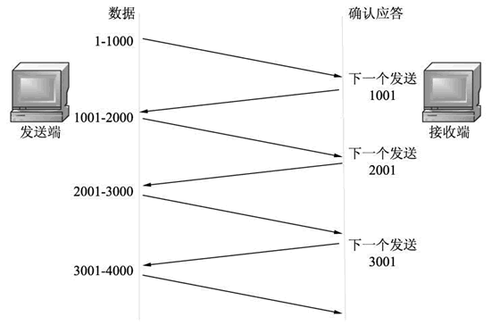
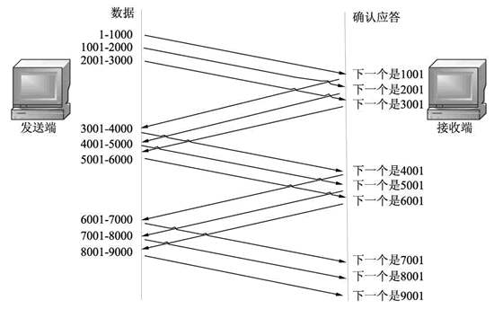
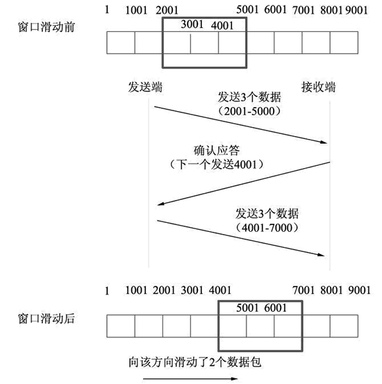
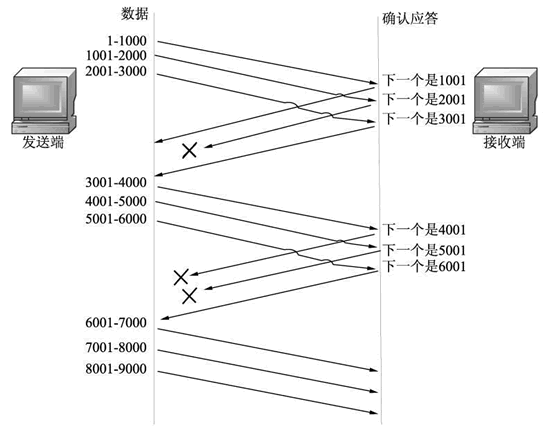
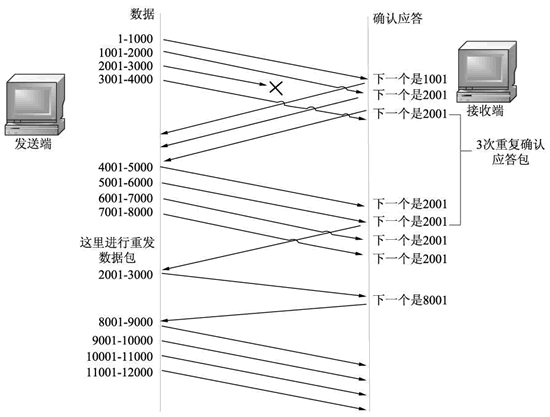
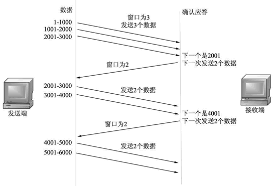
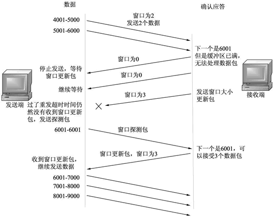

### 滑动窗口机制

在进行数据传输时，如果传输的数据比较大，就需要拆分为多个数据包进行发送。TCP 协议需要对数据进行确认后，才可以发送下一个数据包，如图所示。

从上图中可以看到，发送端每发送一个数据包，都需要得到接收端的确认应答以后，才可以发送下一个数据包。这样一来，就会在等待确认应答包环节浪费时间。为了避免这种情况，TCP引入了窗口概念。窗口大小指的是不需要等待确认应答包而可以继续发送数据包的最大值。

例如，窗口大小为 3，数据包的传输如图所示。

从上图中可以看到，发送端发送第一个数据包（1-1000），没有等待对应的确认应答包，就继续发送第二个数据包（1001-2000）和第三个包（2001-3000）。当收到第3个数据包的确认应答包时，会连续发送3个数据包（3001-4000，4001-5000，5001-6000）。当收到第6个数据包的确认应答包时，又会发送3个数据包（6001-7000，7001-8000，8001-9000）。

以这种方式发送，就可以省去多个数据包（第1、2、4、5、7、8个）的确认应答包时间，从而避免了网络的吞吐量的降低。

窗口大小指的是可以发送数据包的最大数量。在实际使用中，它可以分为两部分。第一部分表示数据包已经发送，但未得到确认应答包；第二部分表示允许发送，但未发送的数据包。在进行数据包发送时，当发送了最大数量的数据包（窗口大小数据包），有时不会同时收到这些数据包的确认应答包，而是收到部分确认应答包。

那么，此时窗口就通过滑动的方式，向后移动，确保下一次发送仍然可以发送窗口大小的数据包。这样的发送方式被称为滑动窗口机制。设置窗口大小为 3，滑动窗口机制原理如图所示。

上图中，每 1000 个字节表示一个数据包。发送端同时发送了 3 个数据包（2001-5000），接收端响应的确认应答包为“下一个发送4001”，表示接收端成功响应了前两个数据包，没有响应最后一个数据包。此时，最后一个数据包要保留在窗口中。

由于窗口大小为 3，发送端除了最后一个包以外，还可以继续发送下两个数据包（5001-6000 和 6001-7000）。窗口滑动到 7001 处。

### 数据重发

在进行数据包传输时，难免会出现数据丢失情况。这种情况一般分为两种。

- 第一种，如果未使用滑动窗口机制，发送的数据包没有收到确认应答包，那么数据都会被重发。
- 第二种，如果使用了滑动窗口机制，即使确认应答包丢失，也不会导致数据包重发。

#### 下面详细介绍使用滑动窗口机制的两种情况。

确认应答包丢失

这种情况指的是前面发送的数据包没有收到对应的确认应答。当收到后面数据包的确认应答包，表示前面的数据包已经成功被接收端接收了，发送端不需要重新发送前面的数据包了。如图所示。

 

发送数据包丢失

这种情况指的是发送端发送的部分数据包没有达到接收端。那么，如果在接收端收到的数据包，不是本应该要接收的数据包，那么就会给发送端返回消息，告诉发送端自己应该接收的数据包。

### TCP 流控制

如果窗口过小，接收端很快就处理了造成很大的延迟。如果窗口过大，发送端发送大量的数据包，而接收端处理不了这么多的数据包，这样，就会堵塞链路。如果丢弃这些本应该接收的数据包，又会触发重发机制。

为了避免这种现象的发生，TCP 提供了流控制。所谓的流控制就是使用不同的窗口大小发送数据包。发送端第一次以窗口大小（该窗口大小是根据链路带宽的大小来决定的）发送数据包，接收端接收这些数据包，并返回确认应答包，告诉发送端自己下次希望收到的数据包是多少（新的窗口大小），发送端收到确认应答包以后，将以该窗口大小进行发送数据包。

TCP 流控制过程如图所示

如果在接收端返回的确认应答包中，窗口设置为 0，则表示现在不能接收任何数据。这时，发送端将不会再发送数据包，只有等待接收端发送窗口更新通知才可以继续发送数据包。

如果这个更新通知在传输中丢失了，那么就可能导致无法继续通信。为了避免这样的情况发生，发送端会时不时地发送窗口探测包，该包仅有1个字节，用来获取最新的窗口大小的信息。

原理如图所示

