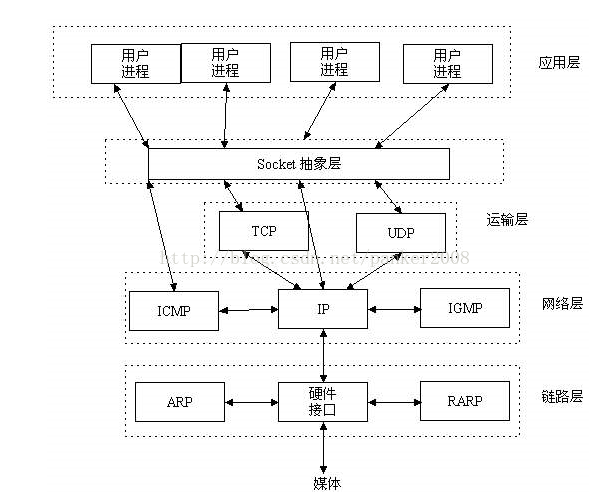
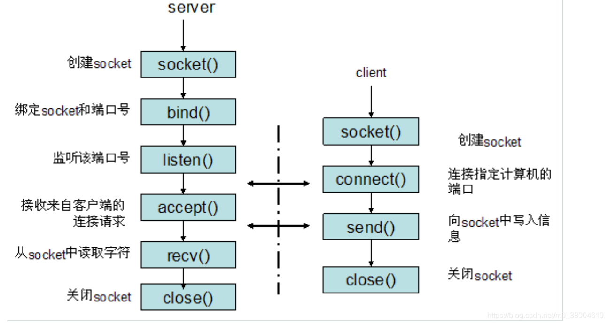
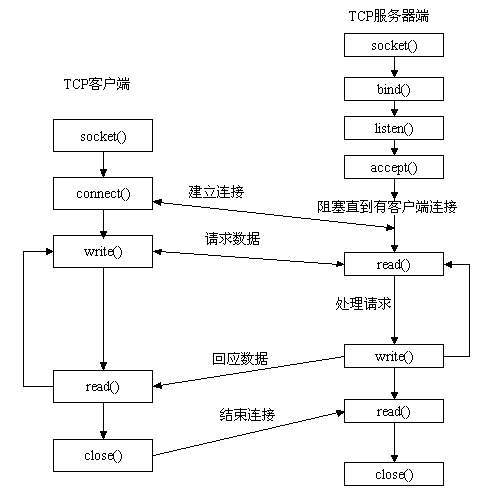

### Socket概念

- 我们可以使⽤PID来唯⼀标示⼀个进程，但PID只在本地唯⼀，⽹络中的两个进程PID冲突⼏率很⼤。
- 我们知道IP层的ip地址可以唯⼀标示主机，⽽TCP层协议和端⼝号可以唯⼀ 标示主机的⼀个进程，这样我们可以利⽤ip地址＋协议＋端⼝号唯⼀标示⽹络中的⼀个进程。
- 能够唯⼀标识⽹络中的进程后，它们就可以利⽤socket进⾏通信了。
- socket是在应⽤层和传输层之间的⼀个抽象层，它把TCP/IP层复杂的操作抽象为⼏个简单的接⼝供应⽤层调⽤已实现进程在⽹络中通信。

+ Socket起源于Unix，在Unix⼀切皆⽂件哲学的思想下，socket是⼀种"打开—读/写—关闭"模式的实现，服务器和客户端各⾃维护⼀个"⽂件"，在建⽴连接打开后，可以向⾃⼰⽂件写⼊内容供对⽅读取或者读取对⽅内容，通讯结束时关闭⽂件。

  

