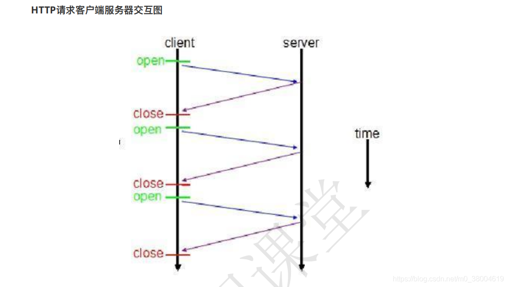
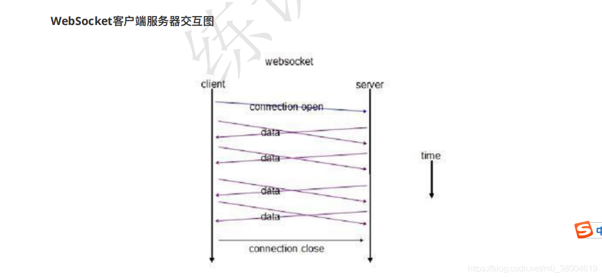

### WebSocket概念

WebSocket protocol 是HTML5⼀种新的协议。它实现了浏览器与服务器全双⼯通信，能更好的节省服务器资源和带宽并达到实时通讯它建⽴在TCP之上，同HTTP⼀样通过TCP来传输数据。WebSocket同HTTP⼀样也是应⽤层的协议，并且⼀开始的握⼿也需要借助HTTP请求完成。

它和HTTP最⼤不同是

WebSocket 是⼀种双向通信协议，在建⽴连接后， WebSocket 服务器和 Browser/Client Agent 都能主动的向对⽅发送或接收数据，就像 Socket ⼀样WebSocket 需要类似 TCP 的客户端和服务器端通过握⼿连接，连接成功后才能相互通信。

上图对⽐可以看出，相对于传统 HTTP 每次请求-应答都需要客户端与服务端建⽴连接的模式， WebSocket 是类似 Socket 的 TCP ⻓连接的通讯模式，⼀旦 WebSocket 连接建⽴后，后续数据都以帧序列的形式传输。

### WebSocket连接过程（握⼿）

从WebSocket客户端服务器交互图可以看出，在WebSocket中，只需要服务器和浏览器通过HTTP协议进⾏⼀个握⼿的动作，然后单建⽴⼀条TCP的通信通道进⾏数据的传送。

1. 浏览器，服务器建⽴TCP连接，三次握⼿。这是通信的基础，传输控制层，若失败后续都不执⾏。
2. TCP连接成功后，浏览器通过HTTP协议向服务器传送WebSocket⽀持的版本号等信息。（开始前的HTTP握⼿）
3. 服务器收到客户端的握⼿请求后，同样采⽤HTTP协议回馈数据。
4. 当收到了连接成功的消息后，通过TCP通道进⾏传输通信。