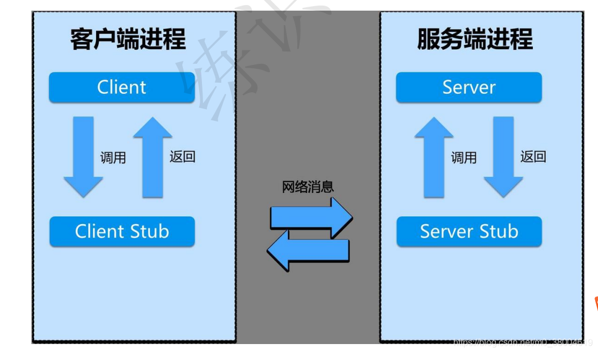

### RPC概念

RPC就是可以跨平台调用，比如A项目用java开发的，B项目用golang开发的，如果B项目里的某个方法想直接调用A项目里的某个方法，双方底层就需要借助一个翻译机器（Client Stub以及Server Stub）来进行翻译并且共同遵守一个约定，比如protobuf、Thrift ，A调用B时，先把信息传给B的翻译机，B的翻译机按照约定进行翻译，然后调用B的方法。

RPC 采⽤客户机 / 服务器模式，通信是建⽴在 Socket 之上的 , 出于⼀种类⽐的愿望， 在⼀台机器上运⾏的主程序, 可以调⽤另⼀台机器上准备好的⼦程序 , 就像 LPC( 本地过程调⽤ ) 。

### 通信流程

1. 客户端（Client），服务的调⽤⽅。
2. 服务端（Server），真正的服务提供者。
3. 客户端存根，存放服务端的地址消息，再将客户端的请求参数打包成⽹络消息，然后通过⽹络远程发送给服务⽅。
4. 服务端存根，接收客户端发送过来的消息，将消息解包，并调⽤本地的⽅法。

### RPC VS HTTP

+ HTTP、Socket只是实现RPC功能的一个工具而已。
+ RPC是传输层协议(4层)，而HTTP协议是应用层协议(7层)。
+ RPC通信协议是长链接（只需要一回三次握手），HTTP协议一般采用短连接（需要每回3次握手）。
+ RPC协议传递数据是加密压缩传输，HTTP协议需要传递大量的请求头信息。
+ RPC协议一般都有注册中心，有丰富的监控机制。