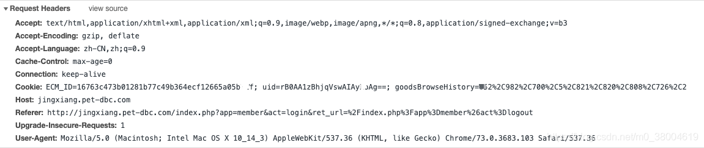
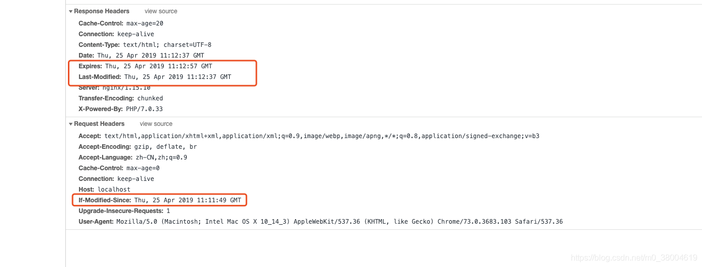

### HTTP请求的header头



+ Accept 

```
作用： 浏览器端可以接受的媒体类型
例如： Accept: text/html 代表浏览器可以接受服务器返回的类型为text/html
通配符 * 代表任意类型
例如  Accept: */*  代表浏览器可以处理所有类型(一般浏览器发给服务器都是发这个)
```

+ Accept-Encoding

```
作用： 浏览器申明自己接收的编码方法，通常指定压缩方法，是否支持压缩，支持什么压缩方法（gzip，deflate）
例如： Accept-Encoding: zh-CN,zh;q=0.8
```

+ Accept-Language

```
作用： 浏览器申明自己接收的语言。 
语言跟字符集的区别：中文是语言，中文有多种字符集，比如big5，gb2312，gbk等等；
例如： Accept-Language: en-us
```

+ Cache-Control

```
1、打开新窗口
值为private、no-cache、must-revalidate，那么打开新窗口访问时都会重新访问服务器。而如果指定了max-age值（单位为秒），那么在此值内的时间里就不会重新访问服务器，例如：Cache-control: max-age=5(表示当访问此网页后的5秒内再次访问不会去服务器)

2、在地址栏回车
值为private或must-revalidate则只有第一次访问时会访问服务器，以后就不再访问。
值为no-cache，那么每次都会访问。
值为max-age，则在过期之前不会重复访问。
 
3、按后退按扭
值为private、must-revalidate、max-age，则不会重访问
值为no-cache，则每次都重复访问
 
4、按刷新按扭
无论为何值，都会重复访问
```

+ Connection

```
例如：　Connection: keep-alive   当一个网页打开完成后，客户端和服务器之间用于传输HTTP数据的TCP连接不会关闭，如果客户端再次访问这个服务器上的网页，会继续使用这一条已经建立的连接
 
例如：  Connection: close  代表一个Request完成后，客户端和服务器之间用于传输HTTP数据的TCP连接会关闭， 当客户端再次发送Request，需要重新建立TCP连接。
```

+ Cookie

```
Cookie是用来存储一些用户信息以便让服务器辨别用户身份的（大多数需要登录的网站上面会比较常见）
```

+ host

```
作用: 请求报头域，主要用于指定被请求资源的Internet主机和端口号，它通常从HTTP URL中提取出来的 
```

+ Referer

```
当浏览器向web服务器发送请求的时候，一般会带上Referer，告诉服务器我是从哪个页面链接过来的，服务器此可以获得一些信息用于处理。比如从我主页上链接到一个朋友那里，他的服务器就能够从HTTP Referer中统计出每天有多少用户点击我主页上的链接访问他的网站。
```

### HTTP响应的header头

响应头代表的信息和请求头一样，代表响应服务端告诉请求服务端的头信息



+ 静态资源缓存

```
header('Cache-Control:max-age=120'); 
这个输出表明让浏览器缓存120秒。这个指令很有用，但是局限性在于，刷新这个页面时还是会重新请求，所以你会感觉这个头好像没什么作用，但是对于一些输出的JS、CSS内容时是有用的。
```

+ 协商缓存

Last-Modified 与If-Modified-Since都是用来记录页面的最后修改时间。当客户端访问页面时，服务器会将页面最后修改时间通过 Last-Modified 发往客户端，客户端记录修改时间，再次请求本地存在的cache页面时，客户端会通过 If-Modified-Since 头将先前服务器端发过来的最后修改时间戳发送回去，服务器端通过这个时间戳判断客户端的页面是否是最新的，如果不是最新的，则返回新的内容，如果是最新的，则返回 304 告诉客户端其本地 cache 的页面是最新的，于是客户端就可以直接从本地加载页面了，这样在网络上传输的数据就会大大减少，同时也减轻了服务器的负担

```
<?php
$interval=120; //2分钟
if(isset($_SERVER['HTTP_IF_MODIFIED_SINCE'])){
    $c_time = strtotime($_SERVER['HTTP_IF_MODIFIED_SINCE'])+$interval;
    // 当大于当前时间时, 表示还在缓存中... 释放304
    if($c_time > time()){
        header('HTTP/1.1 304 Not Modified');
        exit();
    }
}
header('Cache-Control:max-age='.$interval);
header("Expires: " . gmdate("D, d M Y H:i:s",time()+$interval)." GMT");//告诉浏览器这个时间点过期
header("Last-Modified: " . gmdate("D, d M Y H:i:s") . " GMT");//最后修改时间
echo 111111;
echo ' - <a href="">点击重新载入本页面</a><br />';

/**
有时候客户端浏览器的时间可能不准确，但是通过Last-Modified，可以提高缓存时间准确性的问题。当浏览器首次访问时，请求头不会带IF_MODIFIED_SINCE这个东西。
所以我们就设置了三个头。
  第一个头就是刚才第1点，Cache-Control头，告诉让浏览器自己缓存个120秒。
  第二个头Expires是表明，在客户端当前时间的120秒后缓存失效，浏览器会在120秒后把缓存失效，再次请求时会到服务器端请求。
  第三个头Last-Modified则是说明这个文档最后修改时间。
*/
```

### http常用状态码

#### 类别             					原因短语

1xx    信息型状态码            	接收的请求正在处理

2xx     成功状态码              	请求正常处理完毕

3xx    重定向状态码                需要进行附加操作以完成请求

4xx    客户端错误状态码         服务器无法处理请求

5xx    服务器错误状态码         服务器处理请求出错

```
200    一切正常
204    请求成功，但无资源可返回
206    范围请求，请求范围内资源正常返回
301    永久重定向（禁止将POST改为GET，但几乎所有的浏览器都自动转为GET）
302    暂时重定向，URL可能还会改变（禁止将POST改为GET，但几乎所有的浏览器都自动转为GET）
303    暂时重定向，如果是POST，则自动转为GET
304    没收到该请求需要的附带条件
307    暂时重定向，POST不会改为GET
400    请求存在语法错误
401    请求需要有通过HTTP认证的认证信息
403    禁止访问
404    资源没找到
500    服务端处理请求发生了错误，也有可能是web应用存在某些bug或临时的故障
503    服务器过载或者临时维护
```

### http提交数据方式

HTTP协议规定 POST 提交的数据必须放在消息主体（entity-body）中，但协议并没有规定数据必须使用什么编码方式。实际上，开发者完全可以自己决定消息主体的格式，只要最后发送的 HTTP 请求满足上面的格式就可以。

但是，数据发送出去，还要服务端解析成功才有意义。一般服务端语言如 php、python 等，以及它们的 framework，都内置了自动解析常见数据格式的功能。服务端通常是根据请求头（headers）中的 Content-Type 字段来获知请求中的消息主体是用何种方式编码，再对主体进行解析。所以说到 POST 提交数据方案，包含了 Content-Type 和消息主体编码方式两部分。

```
1、application/x-www-form-urlencoded
HTTP的消息体以键值对的形式发送，后台可以通过key获取单个元素，实际中就是我们说的form表单提交
   
2、application/json
HTTP的消息体以json形式发送，后台只能获取整个json不能直接获取单独的key，实际应用广泛
   
3、multipart/form-data
HTTP的消息体以特殊字符分割厚的文本形式，文件内容的上传必须用multipart/form-data
	 
1、text/xml
HTTP的消息体以文本形式发送，后台直接获取整个文本xml进行使用，实际用的比较少
```

### https是什么

- https就是在http的基础上增加一个ssl协议（SSL是基于HTTP之下，TCP之上的一个协议层，是基于HTTP标准并对TCP传输数据时进行加密，所以HPPTS是HTTP+SSL/TCP的简称）。
- 就是在每次通信的时候客户端先从服务端拿到一个CA证书（包含秘钥），并且客户端浏览器验证该证书的安全性，激活客户端浏览器到网站服务器之间的SSL加密通道，在每次数据传输过程中都要经过SSL这一层进行数据加密。

##### https的工作流程

1. 网站的开发人员私下向权威机构（阿里云，可以理解成皇帝）申请证书（圣旨），权威机构颁发证书（皇帝颁发圣旨）。
2. 开发人员下载证书之后配置到自己的代理服务器上，比如Nginx
3. 客户端访问网站会首先得到网站的签名证书（包含公钥等信息），并且用权威机构的公钥（浏览器内部自带的公钥）进行验证是否是权威机构颁发的。
4. 验证成功后浏览器会生成一个随机密码串，这个密码串是用网站的公钥进行加密的（证书里面携带的）
5. 网站收到这个加密的密文，用自己的私钥进行解密得到那个随机密码串
6. 双方的每次数据传输都用那个随机密码串进行加密来保证数据安全性。