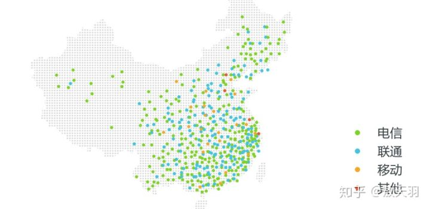

#### 什么是 CDN

「非洲农业不发达，人人都要金坷垃」——相信大家基本上都看过来自美国圣地亚哥的视频，美国人、非洲人和日本人在一起抢来抢去。如果金坷垃只在一个地方生产，那么非洲的运输成本和生产者的产能压力都很大。

那么很简单，我们在世界的每个需要金坷垃的国家都开代工厂，都生产金坷垃——我们的 CDN 就是生产金坷垃的公司，而一个个「节点」就是代工厂。

CDN，中文名叫做「内容分发网络」，它的作用是减少传播时延，找最近的节点，实际上，尽管互联网帮助我们实现了地球村，但是从中国到日本和从中国大陆到中国台湾省的时延仍旧是不一样的，这一点可以从 ping 和 traceroute中看出。

#### CDN 的优点

+ 访问加速：实际上，真正的 CDN 并不是前面举例的一个国家一个节点，甚至是一个运营商，一个省份乃至地区都会有节点。

  

+ 减轻源站（服务器）负载：一个非常简单就能想明白的问题，如果 CDN 已经能帮我返回数据了，那么请求就不会到达源站，源站（服务器）的负载就减轻了。

#### CDN访问原理

1. 首先我们在地址栏键入一个网址，浏览器发现本地没有关于这个网址的 DNS 缓存，所以向网站的DNS 均衡负载系统发起请求。
2. 负载均衡系统解析域名，把对用户响应最快的节点返回给用户，然后用户向该节点发出请求。如果是第一次访问该内容，CDN 服务器会向源站请求数据并缓存，否则的话，直接在缓存节点中找到该数据，将请求结果响应给用户。
3. 对于最简单的 CDN 系统而言，只要一台 DNS 调度服务器和一个节点服务器即可，但在复杂的应用中，会存在多级缓存，多台 Cache 来协同工作。

