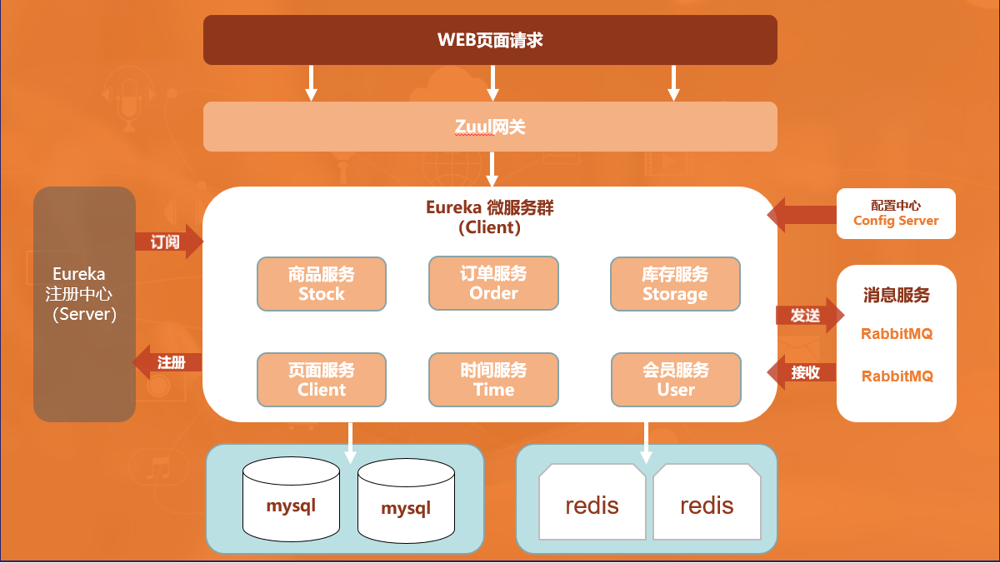
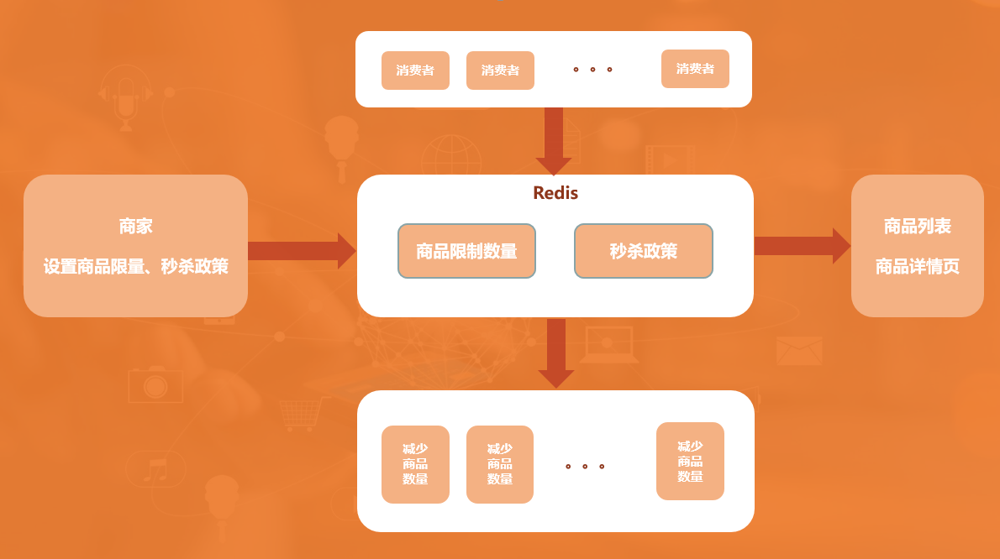
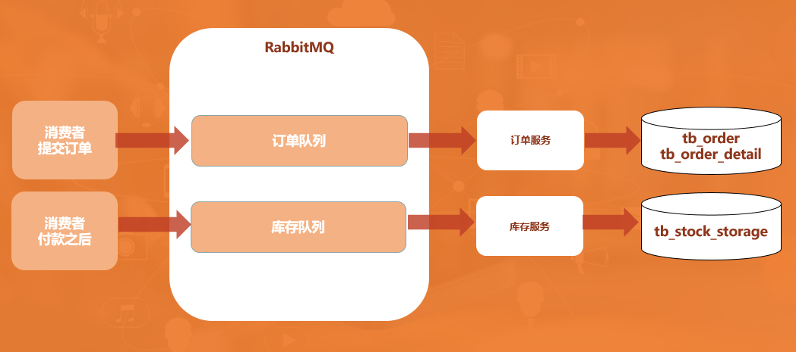

## 1. 什么是秒杀

**秒杀分为三种方式：**

1、限价秒杀：最常见的秒杀形式，秒杀价格绝对低到令人无法相信也无法抗拒而不去参与，此种秒杀一般在开始之后1-3秒之内就会秒杀完毕。

2、低价限量秒杀：此种形式也可以理解为低折扣秒杀，限量不限时，秒完即止，此种秒杀形式商家提供一定数量的商品，直至秒完即止。

3、低价限时限量秒杀：此种形式也可以理解为低折扣秒杀，限时限量，在规定的时间内，无论商品是否秒杀完毕，该场秒杀都会结束。

## 2. 秒杀的业务特点

1、瞬时并发量大：大量用户会在同一时间抢购，网站流量瞬间激增。

2、库存少：一般都是低价限量，而访问的数量远远大于库存数量，只有极少数人成功。

3、业务流程简单：流程短，立即购买，下订单，减库存。

4、前期预热：对于还未开启活动的秒杀商品，以倒计时的方式显示，只能访问不能下单。

## 3. 设计思路

1、预热：商家进行宣传，并提前设置好秒杀的商品、秒杀时间、限购数量，将设置的商品写入 redis 缓存。

2、展示：页面分为两层，第一层是商品列表页，第二层是商品详情页，通过商品列表页链接进入商品详情页，秒杀开始前，展示商品秒杀倒计时，不允许操作提交订单，只允许查看商品详情。秒杀开始时，展示商品秒杀到期时间。

3、时间服务器：页面服务端通过负载进行布署，各服务器时间可能会不一致，因此增加时间服务，来提供统一的时间。

4、限流：只能让秒杀成功的一小部分人进入到后台，和数据库进行交互，来减少数据库服务器的压力。

5、提交订单：秒杀提交完订单将 redis 缓存商品库存的数量减少，并提示支付。

6、异步：将业务逻辑拆分，减少服务器压力，例如：正常业务流程是下订单、付款、减库存同一时间完成，秒杀时可以将业务逻辑拆分。

7、队列操作：当支付成功之后，将秒杀成功详情写入 rabbitMQ，订单服务进行监听接收消息写入订单，库存服务进行监听接收消息减少库存。

## 4. 技术架构

整体架构图：

Eureka Client：

时间服务（leyouTimeServer，端口号8000）：为页面服务提供时间统一的接口。

商品服务（leyouStock，端口号7000）：对外提供的接口（商品列表、商品详情、秒杀政策）。

库存服务（leyouStorage，端口号6001）：队列监听，在队列中提取消息与数据库交互减少库存。

会员服务（leyouUser，端口号5000）：为页面服务提供会员数据接口，会员的添加、修改、登录。

订单服务（leyouOrder，端口号4000）：队列监听，在队列中提取消息与数据库交互生成订单。

页面服务（leyouClient，端口号3000）：为前端页面提供数据接口。

Eureka Server：

注册中心（leyouServer，端口号9000）各服务都在注册中心进行注册。

配置中心 （leyouConfig）：提供所有服务需要的配置。

Redis的应用：

缓存商品数量、秒杀政策：

1、商家对秒杀政策、商品限量进行设置，设置完成写入Redis。

2、消费者访问商品详情，提交订单之后，从Redis中减少商品数量。

Redis里存取内容：

1、在政策新增的时候存入，key的值为：LIMIT_POLICY_{sku_id}，value的值为政策内容

2、商品列表取数据时，通过key（LIMIT_POLICY_{sku_id}），取出政策内容。

3、政策到期之后，自动删除。

RabbitMQ的应用：

消费者提交订单，自动写入订单队列：

订单队列：订单服务监听订单队列，接收到消息之后将队列信息写入数据库订单表。

消费者付款之后，更新订单状态，更新成功之后写入库存队列。

库存队列：库存服务监听库存队列，接收到消息之后将库存信息写入数据库减少库存。
